# DataType

‍

## 整型 Integer

关于整型的最值可以到`<limits>`头文件找

对于`unsigned`类型, 会出现回绕(Wrap Around)现象

而对于`signed`类型, 会出现UB(Undefined Behavior), 可能导致

- 不可预测的后果
- 程序崩溃
- 优化器"不可能"的代码: UB最危险的部分, **编译器可以基于"UB不会发生"来优化代码**

```cpp
int foo(int x) {
    if (x + 1 > x) {  // 如果x是INT_MAX，x+1溢出→UB
        return 1;
    }
    return 0;
}

// 编译器推理：
// 1. 有符号整数溢出是UB
// 2. 根据标准，UB不会发生
// 3. 因此 x + 1 永远不会溢出
// 4. 所以 x + 1 > x 永远为真！
// 5. 优化为：
int foo(int x) {
    return 1;  // 总是返回1！
}

// 测试：
#include <climits>
foo(INT_MAX);  // 应该是0？但实际返回1！
```

以上例子说明, 用`if`来检查是否发生整型溢出是不可能的

可以使用编译器内置函数`__builtin_add_overflow(x, y, &result)`

或用更高精度的类型或库

C23中还提供了标准库函数来检查

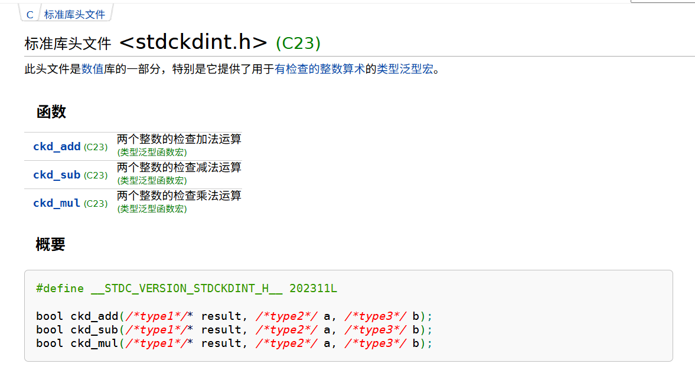

## 单精度浮点数 float

浮点数相关的基础概念

## 类型转化

高精度向低精度转化存在截断问题

C++11引入了列表初始化, 可以禁止窄化转换

```c++
int x = 100000;  // 假设int是32位，值100000
short s = 16位，范围[-32768, 32767]

// 情况1：使用static_cast（传统方式）
short s1 = static_cast<short>(x);  
// 编译通过！运行时：x超出short范围，发生截断（通常是取低16位）
// s1的值是-31072（假设为二进制补码）

// 情况2：使用C++11列表初始化
short s2{x};
// 编译错误！error: narrowing conversion of 'x' from 'int' to 'short'
```

C++风格的类型转换`static_cast`​等而不使用C的`(type)value`转换

int 和 float之间的转换需要注意, 因为float是离散的数值, 当出现无法表示的整数时会发生什么

```cpp
cout.precision(20);
int y_i = ~(1 << 24);
cout << "before :" << y_i << endl;
printBinary(y_i);
float y_f = static_cast<float>(y_i);
cout << "after  :" << y_f << endl;
printBinary(y_f);

// before :-16777217
// 11111110 11111111 11111111 11111111
// after  :-16777216
// 11001011 10000000 00000000 00000000
```

> float（IEEE 754单精度）结构：  
> 符号位（1位） + 指数位（8位） + 尾数位（23位）  
> 实际精度 = 尾数位 + 隐含的1 = 24位二进制位
>
> 这意味着：  
> 可以精确表示：2^24 = 16,777,216 以内的所有整数  
> 超出此范围的整数，会被舍入到最接近的可表示值
>
> 舍入规则（向最近偶数舍入）：  
> -16777217 → 中间值，舍入到偶数 -16777216

### reinterpret_cast<>

重新解释内存这块区域

不会进行任何检查

### any类型和any_cast<>

区别于python中的没有类型的any, python是动态类型语言

​`std::any`​是一个**类型安全的万能容器**，可以在运行时存储和检索任意类型的值。

使用容器中的值时, 必须用`any_cast<>`​转化为对应的类型, 如果转化的不是该值的类型会抛出异常`bad_any_cast`, 保证了一定的安全性

```cpp
std::any a;
a = std::any_cast<int>(a) + 1;  // ❌ 问题：a初始为空，any_cast会抛出异常
std::cout << std::any_cast<int>(a) << std::endl;

a = 1.5;  // ✅ 存储double
std::cout << std::any_cast<double>(a) << std::endl;  // 输出1.5

a = std::string("hello");  // ✅ 存储string
std::cout << std::any_cast[std::string](std::string)(a) << std::endl;  // 输出"hello"
```

​`any`是运行时多态

- 值的类型在运行时确定, 而不是编译器固定的

​`any`的语义与限制

- 支持空值状态, `any`的默认构造就是空值
- 值必须是可拷贝构造的
- ​`any`支持拷贝、移动拷贝、移动赋值

当使用取指针的方式调用`any_cast`​时, 如果类型不匹配并不会抛出异常, 而是返回`nullptr`

```c++
any obj = 42;
auto p = std::any_cast<int>(&obj);
if (p!= nullptr) {
	std::cout << "succeed:" << *p << "\n";
} else {
	std::cout << "type error\n";
```

可以通过`has_value()`来判断是否有值

使用`reset()`清空内容

使用`type().name()`​可以直接访问到类型名称, 注意输出`v`​表示`void`​, 空值时会输出`v`

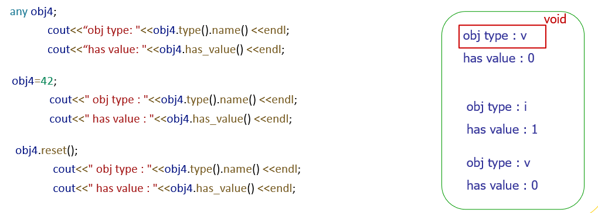

​`any`的内部实现

- 在最前面留出8字节用于管理函数指针
- 后面部分剩下的24字节存对象或指针, 被称为内部缓冲区, 用于SOO(小对象优化), 存储对象或指向堆内存的指针

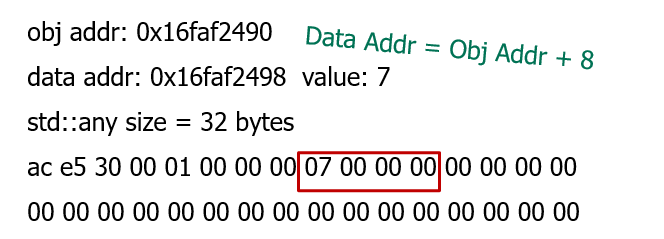

可以看到存储7.5(double)时, 前面8字节的值和存储`int`时是不一样的

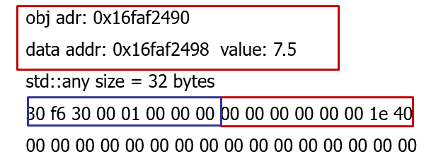

这里因为`0`​的ASCII码为48, 即16进制的`30`, 

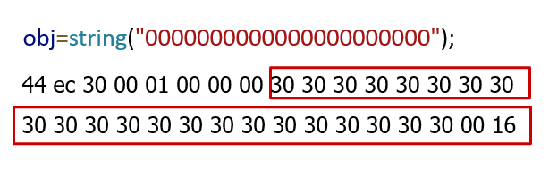

当`any`存储一个大对象, 即后面的24字节缓冲区存储不下该怎么办

- 只能将对象存储到堆上, 然后这里存储指向堆内存的指针

从这个例子也可以看出, 缓冲区是小端序的

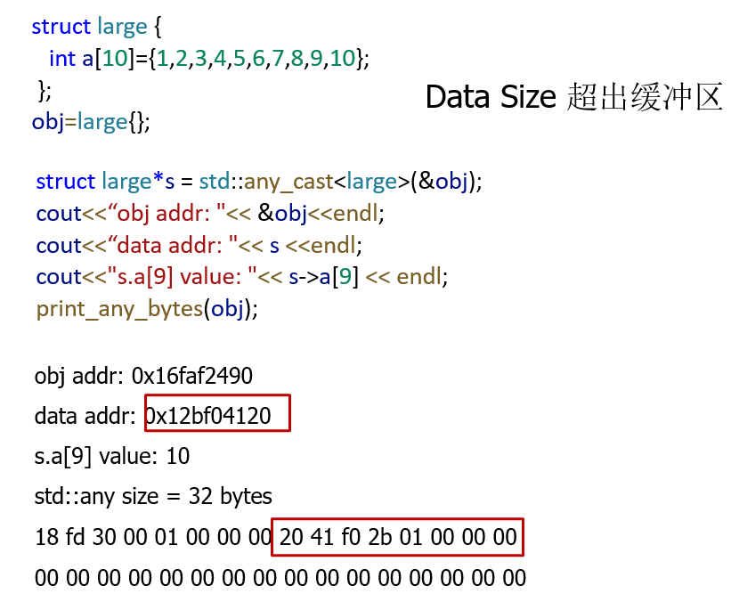

### const_cast<>

C++中尽可能使用`const`

​`const_cast<>`​是**唯一能够去除const限定符**的安全方式, 传入的必须是指针或引用

```cpp
void print(char* str) {
    std::cout << str << std::endl;
}

int main() {
    const char* message = "Hello";
    
    // 错误：不能将const char*转换为char*
    // print(message);  
    
    // 正确：使用const_cast去除const
    print(const_cast<char*>(message));
    return 0;
}
```

使用`const_cast<>`去除const限定符, 然后再去修改它, 会导致UB

```cpp
const int c = 128;               // c是真正的const对象
int* q = const_cast<int*>(&c);  // 去除const限定符（语法允许）
*q = 111;                       // 未定义行为！试图修改真正的const对象
cout << " c " << &c << c << endl;
cout << " q " << &q << q << endl;
cout << "*q " << q << *q << endl;

// 输出
// c  0012FF74    128    // 地址相同，但值"似乎"没变
// q  0012FF70    0012FF74  // q存储了c的地址
// *q 0012FF74    111    // 通过q读取显示111
```

为什么同一个内存地址（0012FF74），通过`c`​访问得到128，通过`*q`访问得到111

- 编译器看到`c`​是const, 基于常量传播的优化, 输出`c`的部分, 直接输出128
- 但输出*p的时候, 实际经过内存读取, 是111

​`const_cast`体现了C++的设计哲学：

- 给你足够的权力做你需要的事
- 但要求你对自己的行为负责
- 信任程序员，但也提供了足够的方式让他们犯错

**程序员介入的事, 编译器不再介入**

### Union

union允许同一个内存位置存储不同的数据类型, **共享内存**

```cpp
union {
	float f;
	int i;
}u;

std::string float2B(float f) {
	u.f = f;
	std::string s ="";
	for (int i=31; i>=0; i--) {
		s += (u.i & (1 << i) ? '1' : '0';
	}
	return s;
}
```

union的大小由其中大小最大的成员决定

union是时间上的共享内存, 即一个时刻中, 只能有一个成员起作用

一个矩阵的例子, 对于矩阵我们可能希望能用$a_{11}$, $a_{12}$这样来访问, 但赋值的时候又希望能像数组那样直接用`m.element[i][j]`​访问, 可以定义这样的`union`

```cpp
union Matrix{
	struct {
		double a11, a12, a13;
		double a21, a22, a23;
		double a31, a32, a33;
	}
	double element[3][3];
};
```

### variant

union存在的一些问题

1. 类型不安全，当union此时存储的是内存较小的变量（如int），但访问了它的较大内存的成员（如double），是UB
2. 无法知道当前union存储的类型：为了解决这个问题在union中放入一个`Variant`​类，它有一个成员变量记录此时union存储的是第几个成员  
    但这种解决方式是**非平凡的**
3. 类型局限性：union在cpp11之前，只能存放内置数据类型，虽然cpp11之后适当放宽，但仍有严格限制  
    这与cpp的一个设计理念相违背：在cpp中用户自定义类型应该和内置类型有同样的地位

以上问题可以通过前面提到的`any`来解决, 但由此引发了新的问题

4. ​`any`是运行时检查, 太迟了

引入Variant `<variant>`

​`variant`是静态检查的

```c++
    std::variant<int, double, std::string> v;
	v = 10;
	std::cout << std::get<float>(v) << std::endl;	// 编译无法通过
```

以下代码运行时会报错`terminate called after throwing an instance of 'std::bad_variant_access'   what():  Unexpected index`

```c++
    std::variant<int, double, std::string> v;
	v = 10;
	v = "hello";
	std::cout << std::get<int>(v) << std::endl;	// 运行时报错
```

​`variant`还可以知道当前存储的是什么类型

```c++
	v = "hello";
	std::cout << v.index() << std::endl;
	// 输出2
```

因此可以更进一步写出更加安全的代码

```c++
    std::variant<int, double, std::string> v;
    v = 42;
    v = 3.14;
    v = "hello";
    if (std::holds_alternative<int>(v)) {
        std::cout << std::get<int>(v) << std::endl;
    }else if (std::holds_alternative<double>(v)) {
        std::cout << std::get<double>(v) << std::endl;
    }else if(std::holds_alternative<std::string>(v)){
        std::cout << std::get<std::string>(v) <<std::endl;
    }
```

如何确定variant的大小

- ​`variant`​大小为对应的`union`​的大小, 再加上一个`index`大小(unsigned int 4字节) 再加上对齐填充到8字节的倍数
- ​`union`大小计算见上方对应部分

**注意**: 这里的`variant size`​计算有误, 应该为40 bytes, 因为`sizeof(string) = 32`, 32 + 4 = 36 再对齐到8字节 40

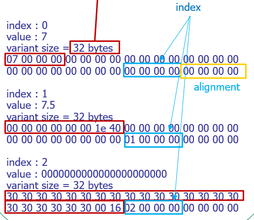

#### 访问者模式复习

有一个访问者类, 方法`visitor()`

被访问者, 方法`accept(Visitor* visitor)`

把具体的计算都交给访问者来完成

使用`variant`配合来完成访问者模式

#### any vs. variant

类型

- any编译期未确定, 在运行时检查
- variant编译期确定并检查, 运行时仅检查当前存放数据的激活索引是否匹配 `std::get<T>()`

访问者模式

- any 需要通过any_cast, 即调用handler, 并通过typeid检查确认类型是否匹配, 含一次函数调用开销和类型比较开销
- variant 直接使用`std::get<T>()`​或`std::get<I>()`​, 类型`T`​或者索引`I`在编译期已知, 内部直接转换为索引访问

## Struct

内部实现上同样有对齐

## tuple

对于一个函数如果希望有多个输出, 之前的方法是在参数处, 通过传入希望输出的值的指针来实现

在cpp中可以通过`struct`来实现

```c++
struct Rtn {
	int i;
	float f;
}
Rtn foo() {
	return {1, 3.0f};
}
```

也可以通过`tuple`​来实现`<tuple>`

```cpp
std::tuple<int, float> foo() {
	return {1, 3.0f};
}
```

tuple是一个有固定大小的异构集合

- 异构集合: 集合中的元素可以是不同的类型的

可以把tuple看作一个轻量化的struct, 当需要struct这样的包装, 但又不想专门封装一个临时数据时, 使用tuple

在C++17后可以直接使用类模板参数推导(CTAD)创建一个`tuple`, 语法和花括号的列表初始化是一样的

什么是CTAD, 类模板参数推导

```cpp
// C++17 之前：必须显式指定模板参数
std::pair<int, double> p1(42, 3.14);      // 必须写 <int, double>
std::vector<int> v1{1, 2, 3, 4, 5};       // 必须写 <int>
std::tuple<int, double, std::string> t1(1, 2.0, "three");  // 必须写完整类型

// C++17 使用 CTAD：编译器自动推导
std::pair p2(42, 3.14);                   // 自动推导为 std::pair<int, double>
std::vector v2{1, 2, 3, 4, 5};            // 自动推导为 std::vector<int>
std::tuple t2(1, 2.0, "three");           // 自动推导为 std::tuple<int, double, const char*>

// CTAD结合C++11引入的列表初始化
std::pair p2
{42, 3.14};  
std::vector v2{1, 2, 3, 4, 5};  
std::tuple t2{1, 2.0, "three"};
```

C++17之后可以使用结构化绑定语法

```cpp
get<0>(r);	// 通过get<I>()访问

int i;
float f;
std::tie(i, f) = r;	// 通过绑定到两个变量上访问
std::tie(std::ignore, f) = r; // 忽略部分值

auto [id, name, score] = getInfo(0); // C++17
```

## optional

C++17新引入的标准库, 可以用来包装函数的返回值


## array

数组作为参数传入函数后, 传入的是一个指针, 是无法通过`sizeof`来获得数组大小的, 所以一般都还需要额外传入一个长度信息

## pointer

C++和C的指针字面量发生了点区别

- C中`#define NULL ((void *)0)`
- C++中`#define NULL 0`

- 为了应对C++出现的函数重载问题, 如果仍像C那样定义, 会出现以下问题  
  有两个函数定义`void func(int);`​和`void func(char*);`​  
  那么`func(NULL);`​是调用哪个函数版本无法确定, 因为`void*`都能传入进去
- C++为了C中的`NULL`​引入`nullptr`​专门表示空指针(C++11): 再次体现C++的[先实现, 后续再优化的设计理念](Introduction.md#20251227201518-q1qgef4)

这也体现了C++的类型更加严格

- 拒绝`void*`​到`T`的隐式类型转换

在现代C++中推荐使用`nullptr`关键字来表示空指针

### unique_ptr

原来的指针使用存在一个问题, 即内存泄漏

C++11引入智能指针`unique_ptr`

```cpp
void newer_use(Args a) {
	auto p = unique_ptr<Blob>(new Blob(a));
	// ...
	if (foo) throw Bad();  // 不会泄漏
	if (bar) return; 	   // 不会泄漏
	// ...
}
```

#### RAII

RAII: Resource Acquisition Is Initialization ==资源获取等价于对象初始化==, 对于任意的资源, 总能找到一个生命期一样的对象来管理

这里的智能指针实际上就是找到一个对象(智能指针对象), 它的生命周期和我们需要管理的资源(Blob)保持一致

#### shared_ptr

两个指针指向同一个对象, 可以使用任意一个指针来访问或修改对象

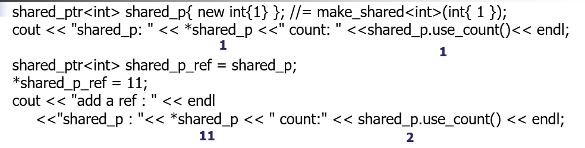

#### weak_ptr

是不控制对象生命周期的智能指针, 指向一个由`shared_ptr`​指向的对象: 用于解决 `shared_ptr` 的循环引用问题，同时提供了一种安全观察共享对象的方式。

基本特性

- ​`weak_ptr`​必须从一个`shared_ptr`​或者另一个`weak_ptr`构造。
- 它不改变所指向对象的引用计数。
- 使用`weak_ptr`​访问对象时，需要先将其转换为`shared_ptr`​（通过`lock()`​函数），因为`weak_ptr`​没有重载`*`​和`->`运算符。

读懂以下两段代码

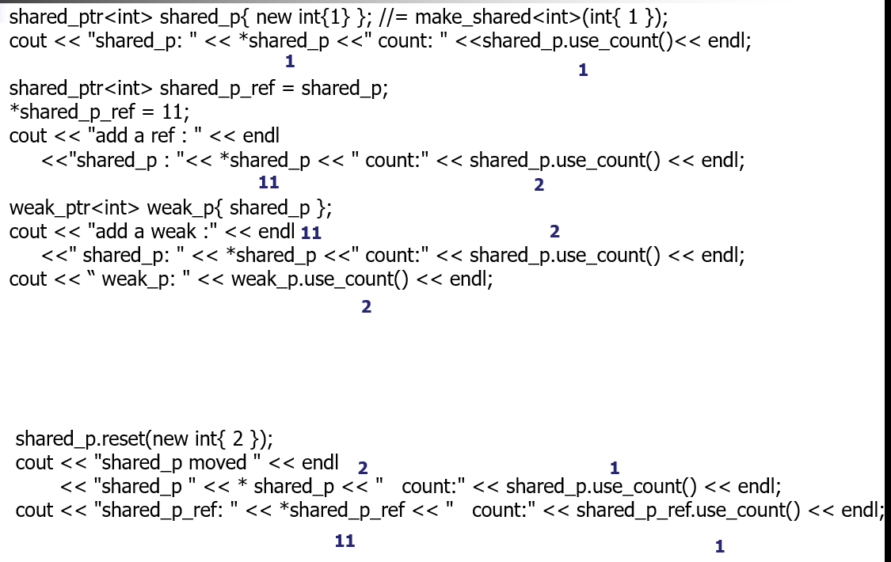

看绿色输出

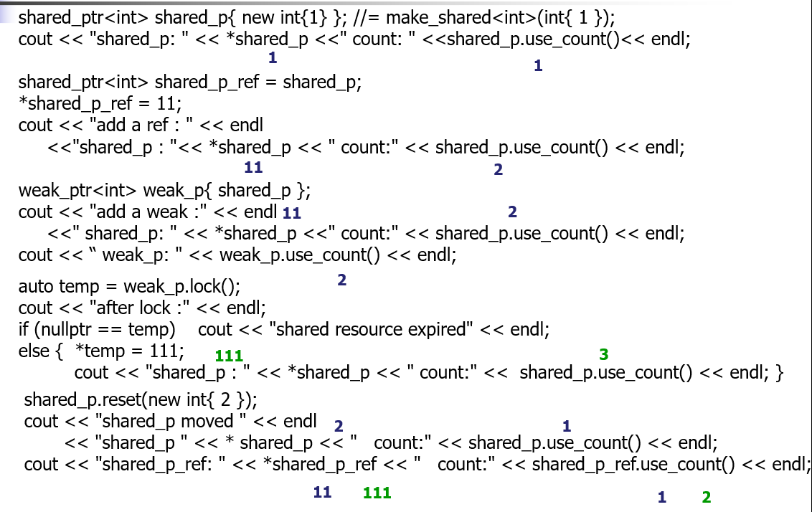

## 指针和数组

注意区分以下几种情况

```cpp
int a[12];
int *p = &a[0];
int *p = a;
int (*p)[12] = &a;	// 指向int[12]的指针
int *p [12];  // 有一个长度为12的数组, 每一个数组元素是int*
```

## 多维数组

Java中有一种不规则数组

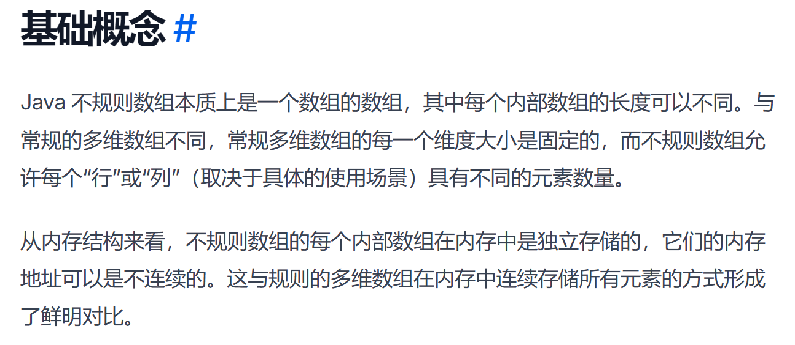

C++也可以类似实现

```cpp
int* jagged[3];  // 3行指针

jagged[0] = new int[2]{1, 2};
jagged[1] = new int[4]{3, 4, 5, 6};
jagged[2] = new int[1]{7};
```

```cpp
vector<vector<int>> jagged;

jagged.push_back({1, 2});           // 第0行有2个元素
jagged.push_back({3, 4, 5});        // 第1行有3个元素
jagged.push_back({6});              // 第2行有1个元素

// 访问
cout << jagged[1][2];  // 输出: 5
```

对于C中常见的二维数组`T A[c1][c2]`, 在cpp中还可以这样表示

```cpp
typedef T U[c2];

T a[c1]; // 表示一个U类型的二维数组

// cpp 中更常用using关键词替代typedef
using T = U[c2];
T a[c1];
```

> 如何查看一个变量类型: typeid(a).name

这也给出了另一种多维数组的实现方法, 即用一维数组来实现

```cpp
int b[12];
using T = int[2];
show((T*)b, 6);  // 此时b就被当作二维数组[6][2]传入
using T1 = int[3];
using T2 = T1[2];
show((T2*)b, 2);  // 此时b就被当作三维数组[2][2][3]传入
```

## 指针和内存

在C中使用`malloc`进行申请内存

实际操作系统申请和释放内存的系统调用是`brk`​和`mmap`​/`munmap`

- 定义`malloc`函数就是为了减少系统调用
- 快速匹配申请的内存和程序需要的内存
- 以及减少锁竞争
- 通过`malloc`内部维护的内存池实现

关于内存泄漏问题, 在`unique_ptr`​之前的C++98使用的是`auto_ptr`, 但存在不少问题

- 反直觉的拷贝语义, `auto_ptr`的拷贝实际上是移动, 因为它不能让两个指针共享指向同一个对象
- 不适合STL容器, STL容器的很多操作如`push_back`会调用拷贝构造
- 不支持数组, 析构时无法调用数组中每个元素的析构函数, 也不支持下标访问 **这些在**​**​`unique_ptr中都有特化实现`​**

## 指针和函数

指针作为函数参数的作用

- 提高传输效率, 只用传递一个指针
- 函数副作用, 或不想有函数副作用, 传入一个常量指针

```cpp
void func1(int *p) {
	// *p 可读可写
}

void func1(const int*p) {
	// *p 只读
}
```

函数指针: 指向函数的指针  
在cpp中经常是这样写的

```cpp
double f1(int x1){...};

using FP = double(*)(int);
FP fp = f1;	// fp就是一个函数指针
fp(1); // 函数调用
```

**在 C++ 中函数名前面的**  **​`&`​** ​ **可加可不加，两种写法完全等价, 即上面代码也可写为**​`FP fp = &f1`​  
同理函数指针的解引用`*`也是可加可不加

- 函数名在大多数上下文中会**自动转换为函数指针**
- ​`&函数名`​ 只是**显式地**获取相同的函数指针
- 两者在类型和值上完全一致

```cpp
void func(int);  // 函数声明

// 以下四种方式完全等价
void (*fp1)(int) = func;     // 隐式转换，最常用
void (*fp2)(int) = &func;    // 显式取地址
void (*fp3)(int) = *func;    // 先解引用？实际上还是函数指针
void (*fp4)(int) = &&func;   // 错误：不能取函数名的地址的地址

// 调用时也等价
fp1(10);     // 直接调用
(*fp1)(10);  // 解引用后调用
(**fp1)(10); // 多重解引用 - 仍然正确！
(***fp1)(10); // 还是正确的！
```

‍
