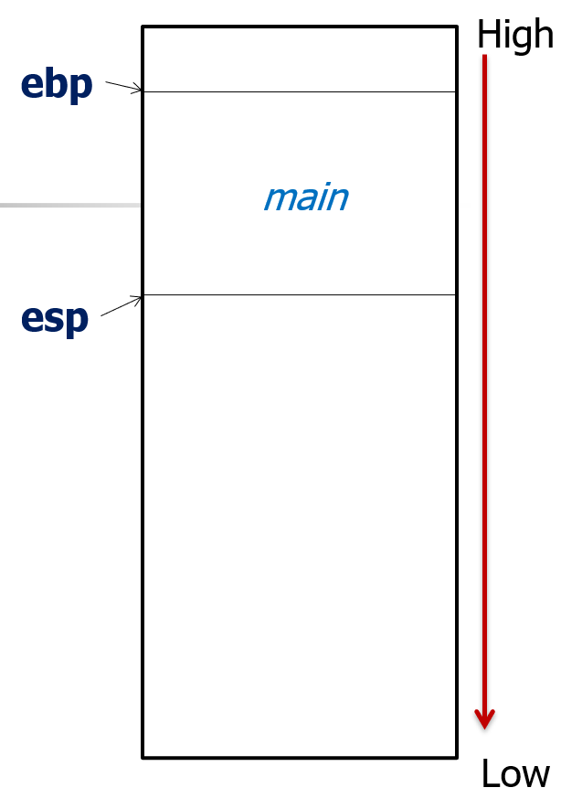
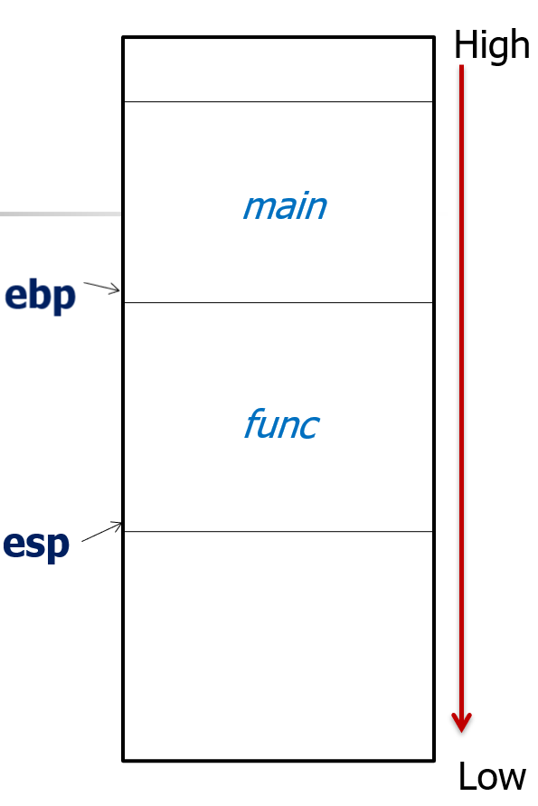
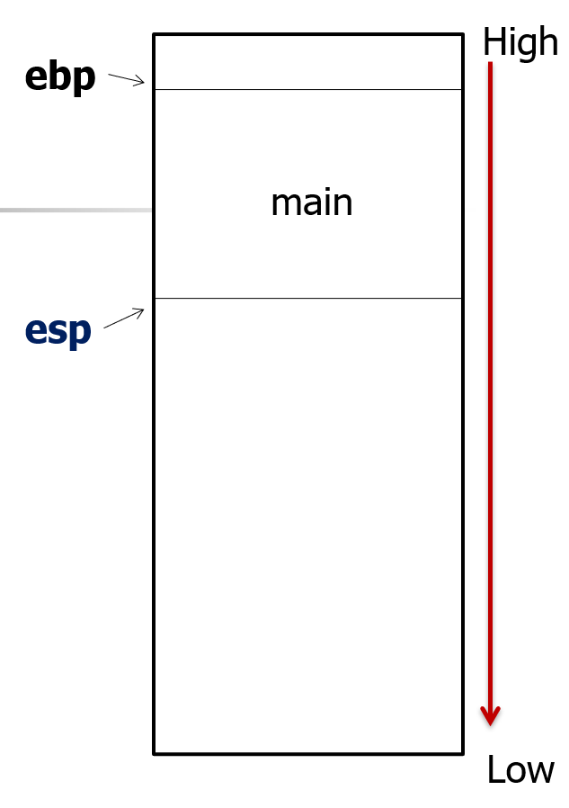

# Function

## 函数

CPP函数的原则

- 定义不允许嵌套, 即函数里面不能定义函数
- 函数要先定义后使用

CPP函数的执行机制

1. 建立被调用函数的栈空间
2. 参数传递, 分为值传递和引用传递两种
3. 保存调用函数的运行状态
4. 将控制权转交给被调用函数

### 函数调用的过程

函数的栈底地址被存储在`ebp`​中, 栈顶地址被存储在`esp`中

以从`main`函数开始完成一次函数调用为例

初始时



发生函数调用, 建立被调用函数的栈空间



调用结束, 压栈退出, 回到`main`函数



函数调用的底层实现

1. 先设置`ebp`为局部变量预留出栈空间
2. 参数入栈, 同时`esp`移动
3. 返回地址入栈, 调用函数者的`ebp`​入栈, 记录为`ebp_main`(方便返回)
4. 对应`esp`​设置到`ebp`往下的栈大小处
5. 执行函数体
6. 开始返回
7. 将`esp`​设置为`ebp`​的值, 然后直接将`ebp`​设置为之前记录好的`ebp_main`
8. 然后`esp`慢慢出栈

### 函数常见的调用约定

​`__cdecl`​: 前面提到的调用过程, 支持变长参数函数, 隐含有格式化串攻击的风险  
为什么`__cdecl`​支持变长参数: 因为`__cdecl`是调用者来清理栈, 调用者知道会传入几个参数

​`__stdcall`​:  区别于`__cdecl`最后函数内部通过 ret 8/16/... 清理栈 (被调用者清理栈)

​`__fastcall`: 省略最开始先分配局部变量栈空间那一步, 前两个参数通过寄存器传递, 剩下的通过栈传递

​`__thiscall`​: C++中成员函数的调用约定, 隐藏一个`this`指针

## 函数重载

原则

- 名字相同, 但参数不同 (个数, 类型, 顺序)
- 返回值的类型不能作为区分

具体的复习见后面的专门函数重载章节

## 带默认参数的函数

默认参数的声明在函数原型中给出

默认参数顺序从右到左, 不能默认参数和非默认参数的交叉

当默认参数和函数重载一起使用时, 可能会有歧义

```cpp
void f(int);
void f(int , int=2);
// 不知道要调用哪个版本, 要避免这样的代码出现
```

## 内联函数

使用关键词`inline`声明内联函数

- 为了提高代码可读性
- 提高效率

编译系统实现方法就是为内联函数创建一段代码, 在函数的调用点, 用相应的代码替换, 省去函数调用的开销

内联函数的限制

- 递归函数无法内联, 需要知道递归的深度, 这个也是运行时才能确定的
- 函数指针无法内联, 因为编译时编译器可能并不知道函数指针指向的是什么函数, 自然也就无法做出替换
- 内联函数适用那些**频率高, 简单, 小段的代码**, 如类中的`get`​和`set`方法

内联函数的缺点

- 增大目标代码, 因为它是直接在编译时用代码替换了函数调用
- 病态的换页
- 降低指令cache命中率

​`inline`​关键字**仅仅是请求**编译器进行内联，实际具体是否会发生内联由编译器决定

在`.h`中实现的函数自动会被内联

- 常见的做法是在`.h`​的类声明中, 实现简单的`get`​和`set`方法来提高运行效率

## 函数式编程

将计算视为数学函数的求值, 避免状态和可变数据

纯函数: 相同的输入总是产生相同的输出, 没有可观察的副作用

> 检查一个字符串是否是另一个字符串的前缀

```cpp
bool is_prefix(std::string prefix, std::string str) {
	return prefix.empty() ? true :
		str.empty() ? false :
		prefix[0] == str[0] ? is_prefix(prefix.substr(1), str.substr(1)): false;
}
```

函数式编程中重要的三个函数

- filter: 对应cpp的filter
- transform: 对应cpp的map
- accumulate: 对应cpp的reduce

```cpp
#include <iostream>
#include <vector>
#include <algorithm>

bool isEven(int n) {
    return n % 2 == 0;
}
int main() {
    std::vector<int> src= {1, 2, 3, 4, 5, 6, 7, 8, 9, 10};
    std::vector<int> target;
    auto new_end = std::remove_if(src.begin(), src.end(), isEven);
	// - 遍历容器中的所有元素
	// - 将所有不满足 isEven 条件（即不被删除）的元素移到容器前端
	// - 返回指向"新逻辑末尾"的迭代器（第一个应该被删除的元素位置）

    src.erase(new_end, src.end());
	// - 删除从 new_end 到 src.end() 的所有元素
	// - 真正地缩小容器大小

    for (int i=0; i<src.size(); i++) {
        std::cout << src[i] << std::endl;
    }
}
```

**C++20 Ranges库**中的**视图(view)**  用法

- ​ **​`|`​** ​ **管道运算符**：类似于Unix/Linux中的管道，将左侧数据传递给右侧操作
- ​**​`std::views::filter`​**：创建一个过滤视图，只保留满足条件的元素
- ​**​`isEven`​**：谓词函数，判断元素是否为偶数

```cpp
#include <iostream>
#include <vector>
#include <ranges>

bool isEven(int n) {
    return n % 2 == 0;
}
int main() {
    std::vector<int> src= {1, 2, 3, 4, 5, 6, 7, 8, 9, 10};
    auto target = src | std::views::filter(isEven);
    for (int i=0; i<src.size(); i++) {
        std::cout << target[i] << std::endl;
    }
}
```

​`transform`函数就是对视图中的每一个元素都调用一次给定函数

```cpp
auto result = src | std::views::filter(isEven) 
                 | std::views::transform(square);
```

- 对**视图中的每个元素**（已经过滤后的偶数）调用 `square` 函数
- **不是对原容器的所有元素**，只对通过 `filter` 的元素
- **惰性执行**：只有在访问元素时才调用 `square`

视图都是惰性执行的

```cpp
// 视图是惰性执行

int expensive_operation(int n) {
	std::cout << "computing: " << n << std::endl;
	return n*n;
}

std::vector<int>numbers = {1, 2, 3};
auto lazy_view = numbers | std::views::transform(expensive_operation);
for (int n: lazy_view) {
	std::cout << "result: " << n << std::endl;
}
// 执行结果
// computing: 1
// result: 1
// computing: 2
// result: 4
// computing: 3
// result: 9

// 非惰性执行的例子
std::vector<int> instant;
std::transform(numbers.begin(), numbers.end(), std::back_inserter(instant), expensive_operation);
for (int n: instant) {
	std::cout << "result: "<< n << std::endl;
}
// 执行结果
// computing: 1
// computing: 2
// computing: 3
// result: 1
// result: 4
// result: 9
```

编译器会对`transform`执行的函数进行优化

1. 函数内联
2. 循环融合, 将多种操作融合到一个循环中一次性完成
3. 消除中间对象, 比如中间`filter`的结果直接就不会生成, 直接去计算最终值

​`accumulate`​函数 `<numeric>`

```cpp
template< class InputIt, class T, class BinaryOperation >
T accumulate( InputIt first, InputIt last, T init, BinaryOperation op );
```

模板参数：

- ​**​`InputIt`​**​：输入迭代器类型（支持 `++`​ 和 `*` 操作）
- ​**​`T`​**：累加结果的类型
- ​**​`BinaryOperation`​**：二元操作函数的类型

参数：

1. ​**​`first, last`​**​：要处理的元素范围 `[first, last)`
2. ​**​`init`​**：初始值，决定了累加结果的类型
3. ​**​`op`​**​：二元操作函数，默认为 `std::plus<>()`（加法）

​**重要特性**：

- 如果范围为空（`first == last`​），直接返回 `init`
- ​`init`​ 的类型 `T` 决定了整个计算的类型

```cpp
#include <numeric>
#include <vector>
#include <iostream>

int main() {
    std::vector<int> nums = {1, 2, 3, 4, 5};
    
    // 使用默认的加法操作
    int sum = std::accumulate(nums.begin(), nums.end(), 0);
    // 计算过程：0 + 1 = 1, 1 + 2 = 3, 3 + 3 = 6, 6 + 4 = 10, 10 + 5 = 15
    std::cout << "Sum: " << sum << std::endl;  // 输出 15
    
    return 0;
}
```

有了这些函数后可以很方便地实现函数式编程

> 计算一个字符串数组中的大写字母数量

```cpp
size_t count_uppercase(const std::vector<std::string>& strings) {
	auto capitalCounts = strings | std::views::transform([](const std::string& str) {
		return std::ranges::count_if(str, [](char c){return std::isupper(c);});
	});

	return std::accumulate(capitalCounts.begin(), capitalCounts.end(), 0);
}
```

## Lamda 表达式

也叫匿名函数

基本语法

```cpp
[capture list] (parameter list) specifiers exception -> type {function body}
```

- capture list: 用于指定Lambda表达式内部如何访问其外部作用域中的变量, 捕获方式有值(=)捕获, 引用(&)捕获和混合捕获
- parameterlist: 定义Lambda表达式的参数, 可以省略
- specifiers: 用于指定Lambda表达式的属性, 如`mutable`
- exception: 用于指定Lambda表达式是否抛出异常, 如`noexcept`
- function body: Lambda表达式的主体部分, 包含具体的执行代码

关于`mutable`标记

- 在类中用`mutable`标记成员变量
- 使得该变量可以在`const`成员方法中被修改
- 在`lambda`表达式中使用, 表示允许修改按值捕获的变量

```cpp
int main() {
    int x = 0;
    
    // 没有 mutable：错误
    // auto f1 = [x]() { x++; };  // ❌ 编译错误
    
    // 有 mutable：正确
    auto f2 = [x]() mutable {
        x++;  // ✅ 可以修改
        return x;
    };
    
    // 调用
    std::cout << f2() << std::endl;  // 输出 1
    std::cout << f2() << std::endl;  // 输出 2
    std::cout << "x = " << x << std::endl;  // 输出 0（按值捕获的副本）
}
```

- 将lambda表达式`f2`看作一个类
- 按值捕获的`x`成为这个类的一个成员变量

对于按值捕获, 且没有`mutable`​关键字的`lambda`​表达式, 我们可以说它是**纯函数**

## std::function

​**​`std::function`​**​ **是通用函数包装器:**  能存储并调用任意可调用对象 (callable object)

- 普通函数
- 函数指针
- 成员函数
- 函数对象
- Lambda表达式

​`std::function`本质是类模板

```cpp
// std::function 是一个类模板，用于包装各种可调用对象
#include <functional>

// 包装普通函数
std::function<int(int, int)> func1 = multiply;
// 这里：
// - multiply 是普通函数
// - std::function<int(int, int)> 是类模板的实例
// - func1 是该类的一个对象
```

用途: 回调注册, 事件处理, 接口设计

- 也可以用来实现多态

## CPP程序中的一些概念

### namespace

声明

```cpp
namespace L{
	int k;
	void f(int);
}
```

使用

```cpp
using L::k;
using L::f;
using namespace L;
```

namespace的一些特点:

1. 可以给namespace起别名 `namespace ATT = American_Telephone_and_Telegraph`
2. 全局命名空间, 不显式属于任何命名空间的内容都在全局命名空间中
3. 命名空间是开放的, 即同一个命名空间可以在多个地方声明和扩展
4. 命名空间可以嵌套
5. 命名空间重载: **函数重载跨越命名空间边界**

```cpp
namespace Math {
    int calculate(int a, int b) {
        return a + b;
    }
}

namespace Physics {
    double calculate(double a, double b) {
        return a * b;
    }
}

// 注意：这不是真正的重载，而是不同命名空间的函数
// 需要using声明或完全限定名

int main() {
    // 完全限定名
    std::cout << Math::calculate(3, 4) << std::endl;    // 7
    std::cout << Physics::calculate(3.0, 4.0) << std::endl;  // 12
    
    return 0;
}
```

**真正跨命名空间的重载**

```cpp
namespace Base {
    void func(int x) {
        std::cout << "Base::func(int)\n";
    }
}

namespace Derived {
    using Base::func;  // 引入Base的func
    
    void func(double x) {  // 重载func
        std::cout << "Derived::func(double)\n";
    }
}

int main() {
    Derived::func(10);    // 调用 Base::func(int)
    Derived::func(3.14);  // 调用 Derived::func(double)
    // ✅ 真正的重载：根据参数类型选择
    
    return 0;
```
