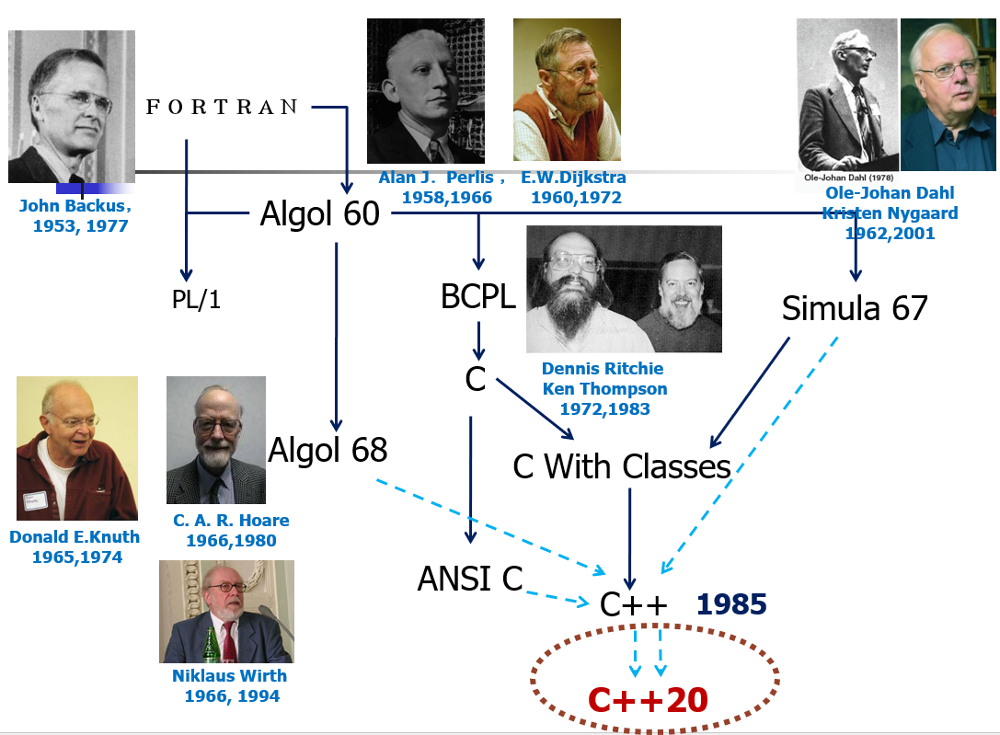

# Introduction

C++是C的超集，支持C所支持的全部编程技巧，任何C程序都能被C++用基本相同的方法编写，并具备同等开销

## C++的历史

Simular67：Kristen Nygaard，面向对象编程的萌芽

OO 面向对象编程：Ole-Johan Dahl

C语言之父：Dennis Ritchie、Ken Thompson，贝尔实验室

1980形成带class的C：Bjarne Stroustrup，作为C的方言

1983正式命名C++：Rick Mascitti，超越了“带类的C”

结构化编程：Dijkstra

1994制定ANSI C++标准草案，第一个国际标准C++98



## 函数式编程

Haskell和Scheme语言

Scheme中的部分语法

- ​`car`: 获取第一个元素
- ​`cdr`: 获取去除第一个元素后的剩余元素

以归并排序为例

```scheme
(define (merge x y)      ; 定义一个函数merge，接受两个参数x和y
  (cond                  ; 条件判断开始
      ((null? x) y)      ; 情况1：如果x是空列表，直接返回y
      ((null? y) x)      ; 情况2：如果y是空列表，直接返回x
      
      ((<= (car x) (car y))   ; 情况3：如果x的第一个元素 <= y的第一个元素
         (cons (car x)         ; 将x的第一个元素作为新列表的第一个元素
               (merge (cdr x) y)))  ; 递归合并x的剩余部分和整个y
      
      (else                    ; 情况4：否则（即x的第一个元素 > y的第一个元素）
         (cons (car y)         ; 将y的第一个元素作为新列表的第一个元素
               (merge x (cdr y))))))  ; 递归合并整个x和y的剩余部分
```

```haskell
-- 1. 类型声明
merge :: Ord a => [a] -> [a] -> [a] -- 函数的类型，表示它接受两个 [a] 类型的参数（两个列表），返回一个 [a] 类型的值（一个列表）
-- 2. 模式匹配1：第二个列表为空
merge xs [] = xs
-- 3. 模式匹配2：第一个列表为空
merge [] ys = ys
-- 4. 模式匹配3：两个列表都不为空
merge (x:xs) (y:ys) -- (x:xs) 是模式匹配：x 绑定到列表的第一个元素，xs 绑定到剩余部分
	| x <= y    = x : merge xs (y:ys)
	| otherwise = y : merge (x:xs) ys
```

四大核心特性

1. 数据不可变, 所有值一旦创建就不能修改
2. 无副作用, 函数不改变外部状态, 只返回计算结果
3. 函数是一等公民, 可作为参数或返回值
4. 引用透明, 相同输入总是产生相同输出

优势

1. 更高的抽象层次: 声明的是做什么而不是怎么做
2. 天然线程安全: 函数无副作用
3. 利于编译器优化: 引用是透明的
4. 数学可证明性: 函数像数学公式那样, 便于形式化证明

局限

1. 学习曲线陡峭
2. 调试难度增加
3. 不适用于状态密集型场景, 如实时游戏开发, 高频金融交易系统, 工业控制系统, GUI应用程序开发

## 逻辑式编程

以prolog语言为例

```prolog
% 事实：数据库中的已知信息
father(john, bob).      % John 是 Bob 的父亲
mother(mary, bob).      % Mary 是 Bob 的母亲
father(bob, alice).     % Bob 是 Alice 的父亲

% 规则：逻辑关系定义
parent(X, Y) :- father(X, Y).      % 如果X是Y的父亲，那么X是Y的父母
parent(X, Y) :- mother(X, Y).      % 如果X是Y的母亲，那么X是Y的父母

grandparent(X, Z) :-               % X是Z的祖父母，如果存在Y使得
    parent(X, Y),                  % X是Y的父母，且
    parent(Y, Z).                  % Y是Z的父母

% 查询：让计算机推理
?- grandparent(john, alice).       % John是Alice的祖父母吗？
% 计算机自动推理：John是Bob的父亲 → John是Bob的父母 → Bob是Alice的父亲 → Bob是Alice的父母
% 因此：John是Alice的祖父母 → 回答：Yes
```

**告诉计算机“问题是什么”，让计算机自己通过逻辑推理找出“答案如何”** 。

## 语言的一些基本概念

抽象数据类型可以分为强类型/弱类型; 静态/动态

C++是一种强类型, 静态类型的语言

## 从C到C++的发展

C++诞生自带类的C, 作为C的一种方言

保持C的接近机器的特点, 同时又具有面向对象接近问题的优势

使用Cpre进行翻译, 将带类的C翻译回C进行编译

> 然而，Cpre和Cfront之间存在着巨大的区别。尽管两者都能生成C代码作为输出，但Cpre几乎没有进行自身的语法检查——它只会寻找一些特定的东西，并对其进行相对机械的转换。直到C编译器检查结果时，才会进行真正的语法分析。如果你的代码包含语法错误，几乎可以肯定在C编译器解析Cpre的输出时才会被捕获。 然而，Cfront对源代码进行了完整的语法分析，因此（除非是其代码生成器中的错误）你将*永远*不会从C编译器看到语法错误。

**不能舍弃C中"危险", "丑陋"的特性而付出效益的代价**

### C++的链接系统

1. 连接兼容性重于代码兼容性

```cpp
// 代码层面兼容
class A {
public:
    void foo(int x);  // 版本1
};

// 改为
class A {
public:
    void foo(int x, int y = 0);  // 版本2
};

// 代码层面：客户端代码仍可编译
// A a; a.foo(5);  // 仍有效（y使用默认值0）

// 链接层面：两个版本不兼容！
// 已编译的客户端代码调用foo@A(int)，但新库提供foo@A(int,int)
// 导致链接错误或运行时错误
```

```cpp
// 源代码
void foo(int);
void foo(double);
void foo(int, char);

// 编译后实际符号名（示例）
_foo_i      // foo(int)
_foo_d      // foo(double)
_foo_i_c    // foo(int, char)
```

**为什么链接兼容性更重要？**

- ​**二进制兼容性**：已编译的二进制模块必须能正常工作
- ​**ABI（应用程序二进制接口）稳定性**：函数调用约定、虚表布局等必须一致

2. 分别编译
3. 类型安全

**C++ vs C 的类型安全对比：**

```cpp
// C语言：仅按名称链接
// file1.c
void foo(int x) { ... }

// file2.c  
void foo(float x) { ... }  // 链接错误！符号冲突

// C++：类型信息编码到符号名
// file1.cpp
void foo(int x) { ... }    // 符号: _foo_i

// file2.cpp
void foo(float x) { ... }  // 符号: _foo_f，不冲突！
```

4. 方便与其他语言实现的模块连接, 这里主要是C语言

5. 不能附加DB, 如散列  
    C++编译后即固定了内存布局, 无法在运行时添加新字段

充分体现了C++的设计哲学: C++选择了静态、确定性的编译模型，放弃了运行时的动态灵活性，换来了极致的性能和明确的二进制接口。

### C++的发展

是稳步前进的

- 实现 + 测试
- 自我应用
- 逐步推广

<span id="20251227201518-q1qgef4" style="display: none;"></span>C++的发展是非论文式的

- 解决实际问题优先
- 允许丑陋但实用的方案
- 逐步完善而非重新设计

C++设计的一个重要观点

- 好的语言不是设计的, 而是成长起来的
- 相比数学, 与工程、社会学、哲学的关系更紧密
- 亲历实验，依赖老练的程序员
- 正交性要让位于有用性和效率

## 考试重点

### C和C++的关系

1. C++是C的**超集**
2. C++支持C**所支持的全部编程技巧**
3. 任何C程序都能被C++用​**基本相同的方法编写**​，并具备**同等开销（时间、空间）**
4. C++还引入了重载、内联函数、异常处理等功能，对C中过程化控制及其功能进行了扩充
5. 此外，C++还添加了面向对象程序设计OOP的完全支持

### C++程序设计语言的设计理念

1. 强大的表述能力
2. 追求效率
3. 实用性优于艺术性
4. 严谨性
5. 相信程序员

### C++的演化历程

FORTRAN：John Backus

- 发明了 FORTRAN，使得编程更贴近于问题本身

结构化编程：Dijkstra

- 发明了编译器，提出 goto 有害论，创建了结构化编程

Father of OO：Ole-Johan Dahl

- 联合发明 Simula 系列语言

Father of **Simular67**：Kristen Nygaard

- 面向对象编程的萌芽
- ​**首个成熟的面向对象编程语言**，固化 OOP 核心机制，验证了抽象化组织复杂程序的可行性，成为 C++ 类机制的直接原型。

C语言之父：Dennis Ritchie、Ken Thompson

1980形成 C with class（带类的C）：Bjarne Stroustrup

- 作为 ​**C 语言的方言**，在 C 基础上嵌入 Simula 风格的 class 关键字与封装特性，未脱离 C 的语法框架，是 C++ 的早期雏形。

1983正式命名C++：Rick Mascitti

- Rick Mascitti：提议将 “带类的 C” 命名为 “C++”，“++” 象征对 C 的增强与超越，标志语言从 “C 的扩展” 转变为具备独立定位的编程语言。

1994制定ANSI C++标准草案

1998 年 C++98 标准发布：第一个国际标准C++98

2003 年 C++03 标准

2011 年 C++11 标准

### Simula 67在其中的作用

1. **是 C++**  <u>面向对象编程（OOP）的思想源头</u>：提供类、对象、继承等 OOP 核心概念，是 C++ 转向多范式语言的直接原型。
2. **填补 C 语言的**​<u>模块化与复杂度管理短板</u>：以类封装、类层次（继承）结构，解决 C 的代码耦合问题，支撑大型程序开发。
3. **是 C++**  <u>关键特性的原型</u>​**并**​<u>推动效率适配</u>：其虚拟过程被改造为 C++ 虚函数（零开销多态），类体系新增访问控制，兼顾抽象与效率。
4. ​**启发 C++ 的核心设计哲学**：推动 C++ 确立 “高效与抽象平衡” 思路，形成零开销抽象、多范式融合的定位。

### C和C++混合编程应该注意的问题

1. <u>名变换：如果调用C语言库中的函数，则需要附加“extern C”</u>，**按照C语言方式编译和连接**，**限制C++编译器进行名变换**，确保 C++和 C 编译器产⽣**兼容**的 obj ⽂件;
2. **静态初始化：**​<u>C++静态的类对象</u>和定义在<u>全局的、命名空间中的或文件体中</u>的类对象的<u>构造函数</u>通常在<u>main被执行前就被调用</u>；**尽可能把主函数main写在cpp文件当中**
3. **内存动态分配**：**C++使用new/delete，C使用malloc/free**，需要注意匹配
4. **数据结构兼容**：将在**两种语言间传递的东西**限制在**用C编译的数据结构的范围内**；这些结构的C++版本可以包含非虚成员函数，**不能有虚函数**。
5. C是结构化编程语⾔，⽽C++⽀持⾯向对象编程语⾔，所以在混合编程时，**不应当出现class等⾯向对象的关键字**。
6. C语言**不支持函数重载**。在C中f (int, int) 与 f(int, double) 是不同的函数，都重载了函数f()；但是在C语⾔中却被认为是相同的函数。因为在编译时，C语⾔给这⼏个函数的命名为f\_；⽽C命名分别为f\_int\_int, f\_int\_double, f\_，以表⽰区别；所以混合编程时应注意重载函数的问题；

### 为什么不叫D语言

因为并没有完全抛弃C中的很多东西。而且事实上的确有一门 D 语言，但是并没有什么人用。C 与 C++已经被无数应用所验证，仍具有顽强的生命力，将其全盘抛弃后新开一门语言是不划算的。

### C++的编译过程

#### 早期C++（80-90年代初）

1. C++源代码先通过cpp预处理后再通过Cfront翻译成C语言，最后通过C编译器来使程序运行。
2. 用Cfront不用Cpre的原因：Cpre不懂C语法，Cfront懂，发现语法错误会传回source code，但Cpre将方言部分翻译成c后交给c编译器，此时若发现错误才传回source code

- Cpre：只翻译，不检查语法。当编译器阶段解析Cpre的输出时才报错
- Cfront：翻译+检查语法。翻译阶段就报错。<u>因此（除非是其代码生成器中的错误）你将永远不会从C编译器看到语法错误。</u>

#### 现代C++：无需转译 C 语言，专用编译器直接编译，Cfront 已被淘汰。

1. <u>预处理</u>：.cpp源文件，处理宏定义、头文件、条件编译等-\>预处理后的`.i`文件
2. <u>编译</u>：语法 / 语义分析、代码优化，将高级语言<u>翻译为汇编语言</u>-\>汇编代码`.s`文件
3. <u>汇编</u>：将汇编代码<u>转换为机器指令</u>-\>二进制目标文件`.o`​（Windows 为`.obj`）
4. <u>链接</u>：合并符号、解析跨文件引用，处理库依赖-\><u>可执行文件</u>（如 Linux 的`a.out`​、Windows 的`.exe`）
